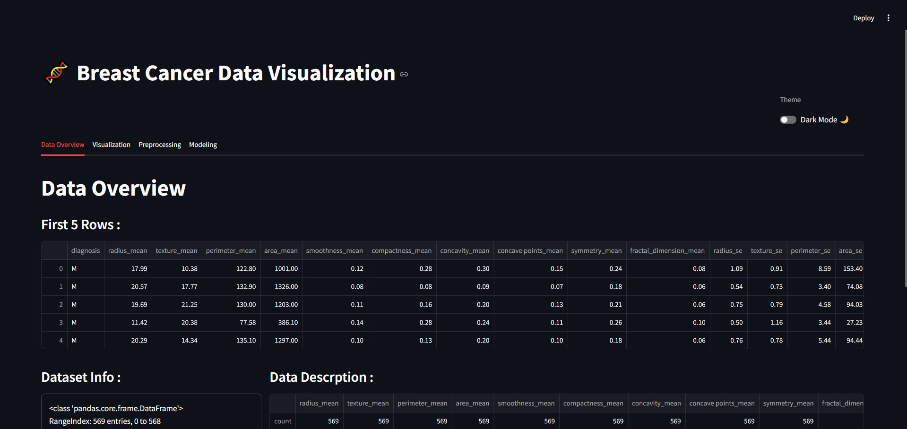
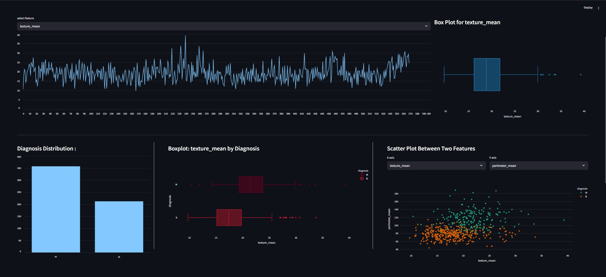
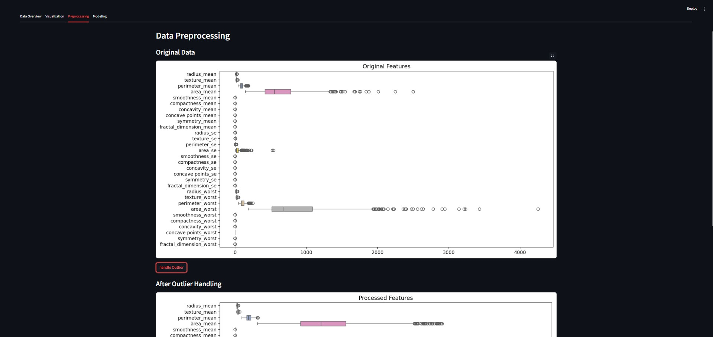
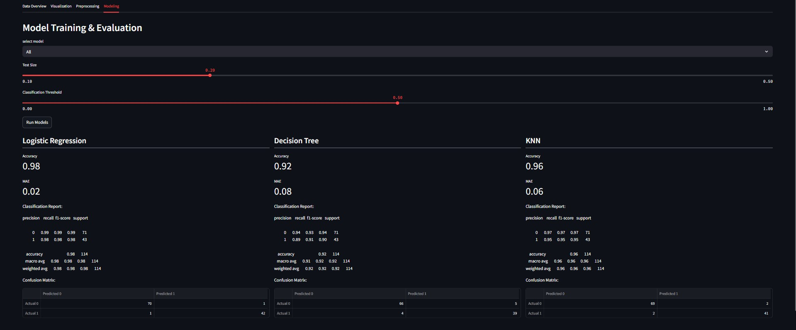

## Breast Cancer Data Modeling Project

This repository contains an end-to-end analysis pipeline for modeling breast cancer data using three classification algorithms: Logistic Regression, Decision Tree, and K-Nearest Neighbors (KNN). The project covers data overview, visualization, preprocessing (including outlier handling), model training, and deployment via a Streamlit app.

---

### Table of Contents

1. [Overview](#overview)
2. [Data Visualization](#data-visualization)
3. [Data Processing & Outlier Handling](#data-processing--outlier-handling)
4. [Modeling](#modeling)

   * [Logistic Regression](#logistic-regression)
   * [Decision Tree](#decision-tree)
   * [K-Nearest Neighbors (KNN)](#k-nearest-neighbors-knn)
5. [Demo Screenshots](#demo-screenshots)
6. [Installation](#installation)
7. [Running the Streamlit App](#running-the-streamlit-app)

---

## Overview

In this section, we introduce the Breast Cancer dataset (Wisconsin Diagnostic Breast Cancer). The dataset includes features computed from digitized images of fine needle aspirate (FNA) of breast masses. Each record is labeled as benign (0) or malignant (1).

Key steps:

* Loading the dataset using `pandas` or `scikit-learn`.
* Displaying basic statistics and class distribution.



---

## Data Visualization

Visual exploration of feature distributions and relationships:

* Histograms and density plots for individual features.
* Boxplots to identify potential outliers.
* Pairplots or correlation heatmap to examine feature correlations.



---

## Data Processing & Outlier Handling

Preprocessing steps:

1. **Missing Values**: Check and impute or drop if necessary.
2. **Outlier Detection**:

   * Use Interquartile Range (IQR) method to flag extreme values.
   * Optionally remove or cap outliers to reduce their effect.
3. **Feature Scaling**: Standardize or normalize features for algorithms sensitive to scale (e.g., KNN).



---

## Modeling

Train and evaluate three classification models using cross-validation and performance metrics (accuracy, precision, recall, F1-score).

### Logistic Regression

* Linear model for binary classification.
* Regularization (L1 or L2) to prevent overfitting.

### Decision Tree

* Non-linear model that partitions data based on feature thresholds.
* Pruning to control tree depth and avoid overfitting.

### K-Nearest Neighbors (KNN)

* Instance-based learning using distance metrics.
* Hyperparameter tuning for optimal `k`.



---

## Demo Screenshots

1. **Overview**: `demo/Overview.jpg`
2. **Data Visualization**: `demo/data_vis.jpg`
3. **Processing**: `demo/process.jpg`
4. **Modeling**: `demo/moeling.jpg`

---

## Installation

1. Clone the repository:

   ```bash
   git clone https://github.com/ayoubmori/Ml-Project-Analyse-Breast-Cancer-Data.git
   cd breast-cancer-modeling
   ```

2. Install dependencies:

   ```bash
   pip install -r requirements.txt
   ```

---

## Running the Streamlit App

Launch the interactive dashboard:

```bash
streamlit run app.py
```

Open the provided local URL in your browser to explore data insights and model predictions through the Streamlit interface.

---

BY AYOUB TAOUABI

---
*Happy analyzing!*
